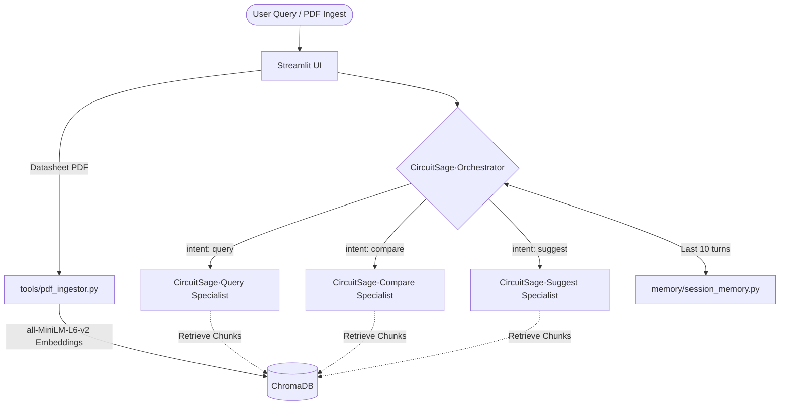

# CircuitSage — EE Datasheet Intelligence Tool


⚡ **CircuitSage** is a multi-agent Electrical Engineering (EE) datasheet intelligence tool built using the **Google ADK** (Agent Development Kit), **Gemini 1.5 Flash**, **ChromaDB**, and **Streamlit**. It allows engineers to upload PDF datasheets and semantically query, compare, and recommend electronic components based on constraints.

---

## 🏆 Kaggle Capstone
This project was built for the [AI Agents: Intensive Vibe Coding Capstone](https://www.kaggle.com/competitions/5-day-ai-agents-intensive-vibecoding-course-with-google)
by Google & Kaggle. Submitted under the **Freestyle** track.

Built with: Google ADK · Gemini 1.5 Flash · Antigravity IDE · ChromaDB · FastMCP · Streamlit

---

## 🏗️ Architecture Overview

CircuitSage leverages a modular multi-agent structure coordinated by a central Orchestrator:



### 1. Agents
*   **CircuitSage·Orchestrator** (`agents/orchestrator.py`): The main routing agent. It receives the user prompt and conversation history, runs a Gemini-based classifier to identify the user's intent (`query`, `compare`, `suggest`), extracts entities, and delegates to the appropriate specialist agent.
*   **CircuitSage·Query** (`agents/query_agent.py`): Answers detailed, technical questions about a specific component using retrieved datasheet segments and provides exact source filename and page citations.
*   **CircuitSage·Compare** (`agents/compare_agent.py`): Fetches spec segments for two component part numbers from ChromaDB and compiles them into a structured parameters comparison dictionary using Gemini 1.5 Flash.
*   **CircuitSage·Suggest** (`agents/suggest_agent.py`): Evaluates candidate component datasheet chunks against target parameters/constraints (e.g. Vgs, Rds(on), thermal limits) and returns a ranked recommendation list with engineering reasoning.

### 2. Tools
*   `tools/pdf_ingestor.py`: Ingests component datasheets, parses them with Langchain `PyPDFLoader`, splits them into character-level chunks (500 size, 50 overlap), embeds them locally using `sentence-transformers/all-MiniLM-L6-v2`, and stores them in ChromaDB.
*   `tools/vector_search.py`: Encapsulates querying ChromaDB for vector similarity, supporting metadata filters for specific components.
*   `tools/mcp_server.py`: Exposes the `pdf_ingestor` as a Model Context Protocol (MCP) tool using `FastMCP`, serving on `localhost:8000`.

### 3. Session Memory
*   `memory/session_memory.py`: Tracks the last 10 turns of user-agent interactions for conversational continuity and contextual pronoun/reference resolution (e.g. "What is its Vgs?" following "Search for IRF540").

---

## 🔒 Security & Code Quality

*   **No Hardcoded Secrets**: Loaded via `python-dotenv` from `.env`.
*   **Input Sanitization**: All user query inputs and components are trimmed and capped at **500 characters** in agent workflows.
*   **Graceful Exceptions**: Every retrieval, parser, and agent run is wrapped in try/except blocks to fail gracefully, reporting user-friendly branded errors instead of stack traces.

---

## 🛠️ Setup Instructions

### Prerequisites
*   Python 3.10 or 3.11
*   A Gemini API Key (obtained from [Google AI Studio](https://aistudio.google.com/))

### Installation
1.  Clone the repository:
```bash
    git clone https://github.com/jahnavib-dev/circuitsage.git
    cd circuitsage
```
2.  Install dependencies:
```bash
    pip install -r requirements.txt
```
3.  Set up environment variables:
```bash
    copy .env.example .env
```
    Open `.env` and add your Gemini API Key:
```env
    GEMINI_API_KEY=your_actual_api_key_here
```

---

## 🚀 Running CircuitSage

### 1. Start the Streamlit User Interface
Launch the web interface locally:
```bash
streamlit run ui/app.py
```
*   Access the UI at `http://localhost:8501`.
*   You can upload datasheets directly via the **sidebar** in the UI to index them.
*   If your `.env` is not set, you can input your API key dynamically in the sidebar.

### 2. Start the MCP Ingestion Server
Launch the MCP server to allow external LLM clients to ingest files:
```bash
python tools/mcp_server.py
```
*   The server will run on `localhost:8000` via SSE.

---

## 💡 Usage Examples

### A. Ingestion
1.  Download a PDF datasheet (e.g., [NE555](https://www.ti.com/lit/ds/symlink/ne555.pdf)).
2.  Upload it using the sidebar file loader in the Streamlit UI, set a component name (e.g., `NE555`), and click **Ingest & Vectorize**.

### B. Chat Interactions
*   **General Query**: *"What is the maximum supply voltage of the NE555?"*
    *   *Routing*: Orchestrator detects `query` intent for component `NE555`.
    *   *Agent*: `CircuitSage·Query` retrieves voltage specs from ChromaDB and returns:
        > "According to the NE555 datasheet (page 4), the maximum supply voltage (VCC) is 16V for the standard NE555 device."
*   **Direct Comparison**: *"Compare NE555 and LM358"*
    *   *Routing*: Orchestrator detects `compare` intent for components `NE555` and `LM358`.
    *   *Agent*: `CircuitSage·Compare` returns a structured specs comparison table rendering parameters like Supply Voltage, Temperature Range, and Packages.
*   **Component Suggestion**: *"Recommend a timer or operational amplifier with low supply current"*
    *   *Routing*: Orchestrator detects `suggest` intent.
    *   *Agent*: `CircuitSage·Suggest` searches ChromaDB chunks, compares supply currents of components, and outputs a ranked list of recommended parts with detailed engineering logic.

---

## 📁 Project Structure
circuitsage/

├── agents/

│   ├── orchestrator.py       # Master routing agent with session memory

│   ├── query_agent.py        # CircuitSage·Query specialist

│   ├── compare_agent.py      # CircuitSage·Compare specialist

│   └── suggest_agent.py      # CircuitSage·Suggest specialist

├── tools/

│   ├── pdf_ingestor.py       # PDF parsing, chunking, embedding, storage

│   ├── vector_search.py      # ChromaDB similarity search wrapper

│   └── mcp_server.py         # FastMCP server on localhost:8000

├── memory/

│   └── session_memory.py     # Last 10 turns session tracker

├── ui/

│   └── app.py                # Streamlit UI

├── data/

│   └── chroma_db/            # Local vector store (gitignored)

├── CONTEXT.md                # Antigravity coding standards

├── .env.example              # Environment variable template

├── .gitignore                # Ignores .env, chroma_db, pycache

└── requirements.txt          # Pinned dependencies
---

## 👤 Author

Built by [@jahnavib-dev](https://github.com/jahnavib-dev) as part of the Google & Kaggle 5-Day AI Agents Intensive — June 2026.